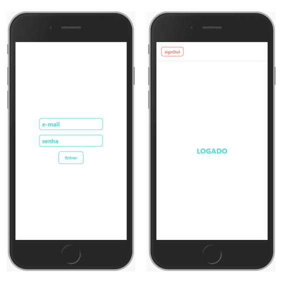

# expo-login-ts

## start

```expo start ```

## React-Native EXPO TypeScript

Projeto de página de login a fim de estudos, fazendo uso do  Navigation, Context API e pensistência de dados utilizando o AsyncStorage. 

